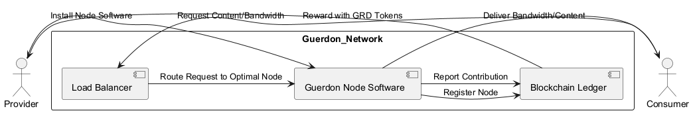
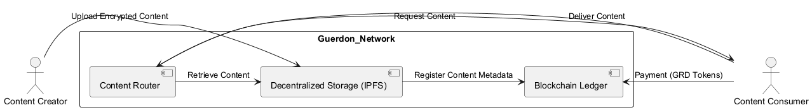
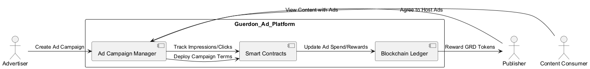

# Overview
Guerdon is a decentralized media platform built on the blockchain to make content delivery and advertising more affordable, transparent, and fair. Here’s a simplified explanation of what it does:

1. Decentralized Bandwidth Sharing:

* Guerdon creates a network where people and businesses can share their unused internet bandwidth.
* Participants install software that connects them to the network, letting them earn Guerdon Tokens (GRD) in exchange for their bandwidth.

2. Content Delivery Network (CDN):

* Instead of relying on centralized services like AWS or Akamai, Guerdon uses blockchain and decentralized storage to host and deliver content (like videos, live streams, or files) more cheaply and securely.
* Its system uses smart contracts to ensure fair distribution and rewards for bandwidth providers.

3. Advertising Services:

* It offers a platform for advertisers and content creators to work directly together.
* Advertisers pay in GRD to show ads, and publishers (those hosting ads) earn GRD in return. Everything is tracked on the blockchain, ensuring no fraud and complete transparency.

4. Token Ecosystem:

* The platform runs on the Guerdon Token (GRD), which is used for payments, staking, governance, and rewards.
* It has mechanisms to maintain and even increase the token’s value over time, such as token burns and staking rewards.

5. Who Benefits:

* Content Creators: They can host and deliver their content securely and at a lower cost.
* Advertisers: They get detailed analytics and reduced fees compared to traditional platforms like Google Ads.
* Users: They can earn rewards by contributing their unused internet bandwidth.

# Guerdon's core idea revolves around using blockchain to power content delivery, with its main offerings targeting these three areas:

1. Decentralized Bandwidth Sharing:

This is the backbone of the platform. People and businesses can share unused internet bandwidth, forming a peer-to-peer network.
It's like creating a crowd-powered internet highway where participants are rewarded (in Guerdon Tokens) for sharing their bandwidth.

2.Content Delivery Network (CDN):

Guerdon provides a decentralized alternative to traditional CDNs (like AWS CloudFront or Akamai).
It's aimed at securely and efficiently hosting and delivering things like videos, live streams, and large files at lower costs.

3. Advertising Services:

Guerdon’s advertising platform connects advertisers and publishers directly.
Instead of going through big players like Google or Facebook, advertisers pay in tokens to show ads, and publishers earn tokens transparently.
Fraud prevention and analytics are handled using smart contracts, ensuring trust and fairness.

# Target Audience:

These three areas represent the key services Guerdon offers, and the target audience includes:

Content creators: To distribute their content reliably and affordably.
Advertisers: To run more transparent, cost-effective ad campaigns.
Individuals/Businesses: To earn rewards by sharing their bandwidth.

# Use Cases and Logic Flow

## Decentralized Bandwidth Sharing

Use Case: Peer-to-Peer Bandwidth Sharing
Actors: Bandwidth Providers (Individuals/Businesses), Guerdon Node Software, Blockchain Ledger

## Content Delivery Network (CDN)

Use Case: Decentralized Content Delivery
Actors: Content Creators, Content Consumers, Guerdon Network

## Advertising Services

Use Case: Transparent Ad Marketplace
Actors: Advertisers, Publishers, Guerdon Ad Platform

## Guerdon Node Flow

